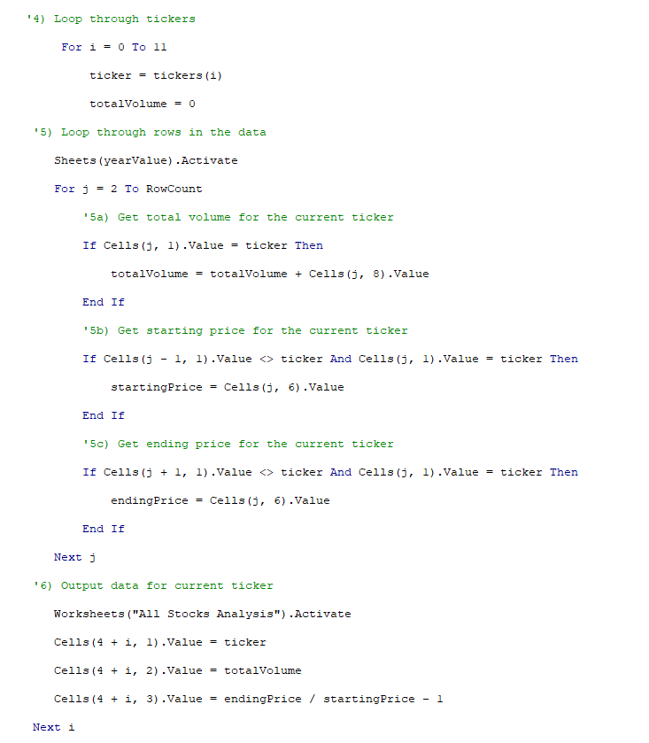
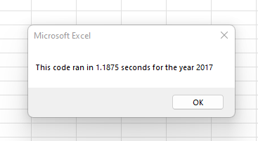
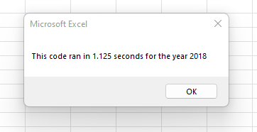
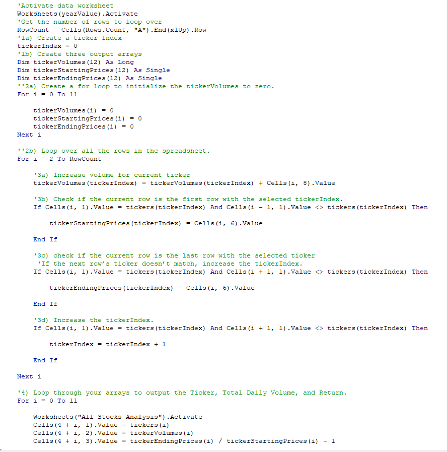
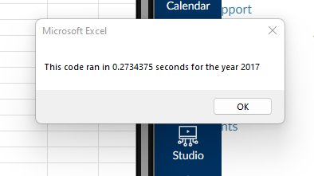
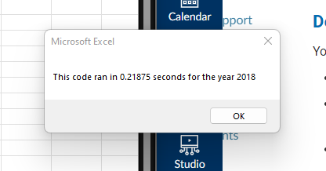

# **Stock Analysis with VBA in Excel**

## **Overview of the Project**

### This project explores the runtime speed differences between two possible codeded VBA Macros used to find pertinent decission making information about multiple green and renewable energy stock tickers.

### The client, Steve, is assisting his parents in choosing green and renewable energy stocks to invest in.  They are very fond of the company Daqo(DQ) but our initial analysis of DQ stock was not so hot.  Steve would like to expand his parents' stock portfolio with more promising options.

### Steve supplied us with stock ticker information for 12 green stock options he believed were worth looking into for the years 2017 and 2018.

### The goal of the initial VBA code was to quickly find the pertinent decision making information such as total yearly volume of each stock sold and the percentage by which each stock had either increased or decreased in value over the course of the year. To do this, the initial VBA code utilized a series of nested for loops circling to find this data for one array that included each of the 12 tickers.

### The purpose of this challenge was to refactor the code instead to loop through each of the 3 decision making factors as variables nested for each of the tickers in order to witness the potential speed differences in each format of the VBA code.

## **Results**

### The original code we used in Module 2 to find the total yearly volume of each stock and the percentage by which each stock had either increased or decreased in value over the course of that year created an array for the 12 stock tickers and used nested for loops to find the information. See the below screenshot for code details.

### As you can see in the following screenshots, running this code for each of the given years timed in at over 1 second.

   

### To refactor the code we used in Module 2, we instead created an array for each of the decision making factor information variables and ran a single for loop using conditionals to generate the values for each of the 12 tickers. See the below screenshot for code details.

### By running a single for loop with conditionals for the multiple arrays, we noticed a considerable increase in the runtime speed of our analysis code.

### Here you can see that the runtime speed for the refactored code is about .2 seconds for each year analyzed.  This is significantly faster than the original code.

   

### **Summary**

### Advantages and Disadvantages of Refactoring Code in General

#### The main advantages to refactoring code in general is that it has the ability to create more concise codes that run faster and that more visually connect with any user who goes to run the code.  It appears clearer and more organized.  It may also be easier to debug refactored code because we can more easily narrow in on a problem when there are fewer total lines of code. On the other hand, a disadvantage is that we may not always be able to refactor certain codes.  It may also prevent flexibility for future users.

### Advantages and Disadvantages of the Original and Refactored VBA Script 

#### Looking at the differences between the original code and the refactored code in this challenge, there is a clear advantage in the runtime of the refactored code over the original code.  The refactored code is significantly faster.  The refactored code is more concise and easier to read.  However, the original code broke down into more steps and might have the advantage of being more useful when transfered to other coders who wish to run similar analyses in the future.

